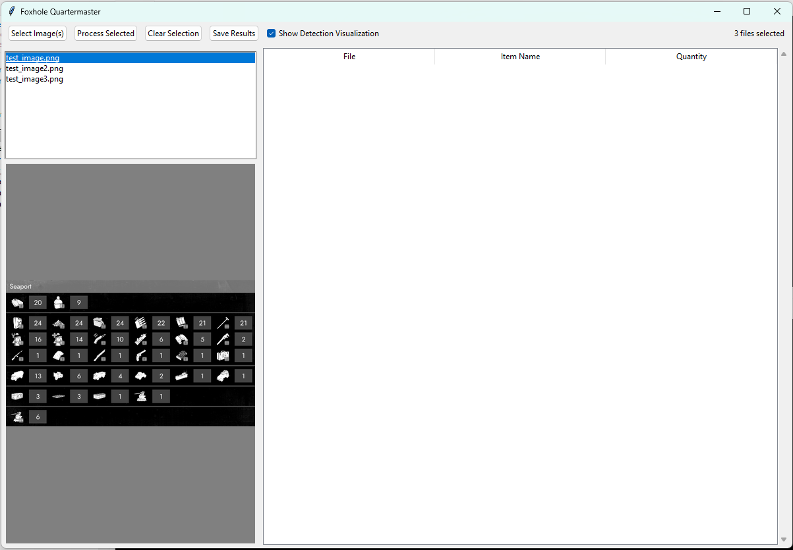

# foxhole-quartermaster
An application for compiling and tracking stockpile data for the game Foxhole.

*NOTE: Heavily WIP*

## General Use

1) Download the latest release (.exe)
2) Run the program
3) Add a screenshot
4) Generate a report (which creates an excel spreadsheet)
5) (Optional) Run basic analytics on the data using the analysis window tab

NOTE: The included files such as the data/catalog.json, data/processed_templates and data/number_mappings.csv are necessary, including the Reports directory (which is where generated data will be placed).

## Goal(s)

1) A simple stockpile management tool that involves screenshots, and translating those screenshots into spreadsheets.
2) Ease of usage for all players.
3) Powerful analytical tools and insights.

## TODO

- ~~All the item mappings are not finished; I play warden, and have yet to finish updating the colonials weaponry, and most of the vehicles.~~

- ~~Further refinement~~

- Expansion of the feature set.

- Optimize and improve speed

## Screenshots

## License

Software is provided as-is and the author assumes no responsibility for its usage.

MIT

## Advanced Users: Build Instructions

1) Download the source code
2) Open Thonny (or a similar program)
3) Check for installed prereqs (Numpy, Pyinstaller, OpenCV, etc.)
4) Open a console in the source code folder
5) type into your console `build.bat` or python build_app.py
6) ????
7) profit
